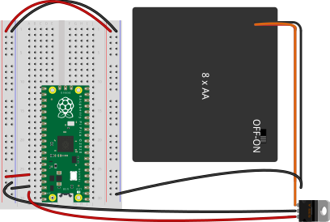

# Project 01 - START

_Suggested Video:_ [What is a Microcontroller? by Microchip Technology, Inc.](https://www.youtube.com/watch?v=jKT4H0bstH8)

*Note:* If you are using only USB-C power for the microcontroller, this project can be skipped. All the projects should be able to run without this lab. However, if you wish to run the microcontroller without a computer (or AC power), this is highly recommended.

This project requires the CircuitPython boot image and uses the following components:
- Medium-sized (or larger) solderless breadboard
- Wires
    + Positive rail to positive rail (from one side to other)
    + Negative rail to negative rail (from one side to other)
    + Positive rail to `3v3` pin on microcontroller
    + Negative rail to `GND` pin on microcontroller
- Battery Pack (4x AA required; 8x AA with switch recommended)
    + Negative wire hooked to negative rail
- LM7805 Voltage Regulator
    + `Input` on voltage regulator (leftmost pin when the tab is towards the back) hooked to the positive battery pack wire
    + `GND` on voltage regulator (center pin) hooked to the negative rail
    + `Output` on voltage regulator (rightmost pin when the tab is towards the back) hooked to `Vin` pin on microcontroller

---
### Diagram

