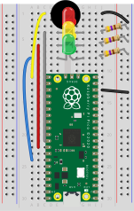

# Project 03 - SET

This project requires the CircuitPython boot image and uses the following components:
- 3x LEDs (preferably red, yellow, and green)
    + Red hooked to `pin 26`
    + Yellow hooked to `pin 27`
    + Green hooked to `pin 28`
    + NOTE: LEDs are polarized, so they only work in a single direction. If it doesn't work, the LED might need to be flipped.
- 3x 470 Ohm Resistor
    + Hooked between the LEDs and ground (either a ground rail or GND on the microcontroller)
- 160 Ohm Passive Electronic Buzzer
    + Positive (normally marked + on the buzzer) hooked to `pin 16`, negative hooked to ground
---
### Diagram

*Note:* The diagram does not show the power setup from project 1, if you are using it, the connections from 13j to the negative (-) rail can be omitted.
