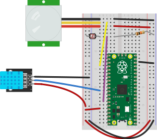

# Project 04 - INNNPUT

_Suggested Video:_ [Digital vs Analog. What's the Difference? Why Does it Matter? by Basics Explained, H3Vtux](https://www.youtube.com/watch?v=ZWdT-6Ld71Q)

This project requires the CircuitPython boot image and uses the following components:
- 10K Ohm Resistor (mentioned below)
- LDR Photo-resistor Light Sensor Photocell
    + Hook one side to the positive rail
    + Hook the other side to the negative rail using a 10K Ohm resistor
    + Between the 10K Ohm resistor and the sensor, connect a wire to `pin 28`
- DHT11 Humidity and Temperature Sensor
    + Positive hooked to the positive rail (or 3.3V output)
    + Negative hooked to the negative rail (or microcontroller's GND)
    + Out on board hooked to `pin 26`
- PIR Motion Sensor
    + Positive hooked to the positive rail (or 3.3V output)
    + Negative hooked to the negative rail (or microcontroller's GND)
    + Out on board hooked to `pin 18`
---
### Diagram

*Note:* The diagram does not show the power setup from project 1, if you are using it, the connections from 24a to the positive (+) rail and 13j to the negative (-) rail can be omitted.
