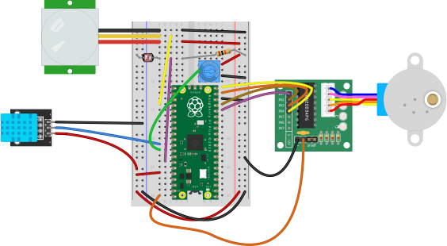

# Project 05 - Motor Mania!

_Suggested Video:_ [How Stepper Motors Work - Electric motor by The Engineering Mindset](https://www.youtube.com/watch?v=09Mpkjcr0bo)

This project requires the CircuitPython boot image and uses the following components:
- 10K Ohm Resistor (mentioned below)
- LDR Photo-resistor Light Sensor Photocell
    + Hook one side to the positive rail
    + Hook the other side to the negative rail using a 10K Ohm resistor
    + Between the 10K Ohm resistor and the sensor, connect a wire to `pin 28`
- DHT11 Humidity and Temperature Sensor
    + Positive hooked to the positive rail (or 3.3V output)
    + Negative hooked to the negative rail (or microcontroller's GND)
    + Out on board hooked to `pin 26`
- PIR Motion Sensor
    + Positive hooked to the positive rail (or 3.3V output)
    + Negative hooked to the negative rail (or microcontroller's GND)
    + Out on board hooked to `pin 18`
- _(All these prior steps were part of project 4)_
- 10K Ohm Trim Potentiometer with Knob
    + Positive (one side) hooked to positive rail (or 3.3V output)
    + Negative (other side) hooked to negative rail (or microcontroller's GND)
    + Center pin hooked to `pin 27`
- Stepper Motor and 5V 28BYJ-48 Motor Driver
    + Positive (one side) hooked to microcontroller's VOUT (5v)
    + Negative (other side) hooked to negative rail (or microcontroller's GND)
    + IN1 to `pin 12`, IN2 to `pin 13`, IN3 to `pin 14` and IN4 to `pin 15`
---
### Diagram

*Note:* The diagram does not show the power setup from project 1, if you are using it, the connections from 24a to the positive (+) rail and 13j to the negative (-) rail can be omitted.
